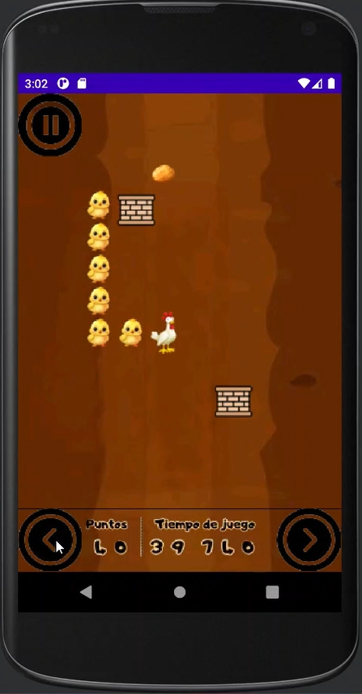
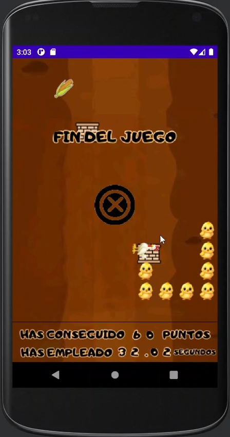
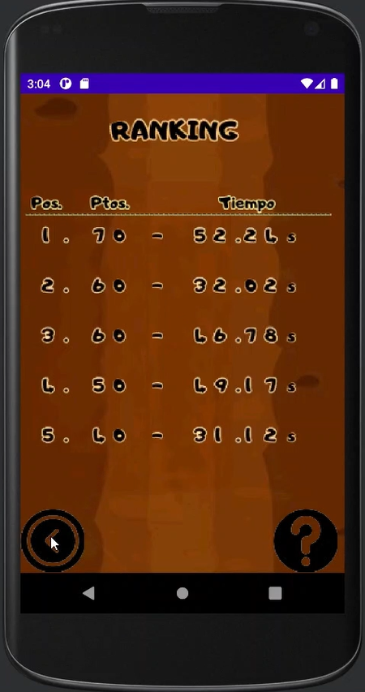

# La Gallina Turuleca

## Descripción

**La Gallina Turuleca** es un juego estilo Snake desarrollado en Android Studio en el que controlas una gallina que debe recoger alimentos dentro de un corral. Cada vez que la gallina come, un pollito se une a ella, aumentando su tamaño. El objetivo es comer la mayor cantidad de alimentos posible sin chocar contra los muros o sus propios pollitos.

## Funcionalidades

- **Ranking de tiempo**: El ranking muestra las puntuaciones de las partidas junto con el tiempo empleado. En caso de empate en la puntuación, el tiempo es el factor decisivo.
  
- **Contador de tiempo en partida**: Un cronómetro muestra los segundos y milisegundos transcurridos durante la partida, lo que permite al jugador ver cuánto tiempo le ha tomado completar el juego.

- **Muros**: El mapa del juego incluye muros fijos que deben evitarse. Si la gallina se estampa contra ellos, la partida finaliza.

- **Música**: El juego tiene dos pistas musicales. Una suena en el menú principal y otra durante la partida. La música está en bucle y mejora la experiencia de juego.

- **Resumen de la partida**: Al finalizar la partida, se muestra un resumen con la puntuación obtenida y el tiempo empleado. Dependiendo del tiempo y la puntuación, se ajusta la visualización del resumen para que no se solapen los elementos.

- **Pantallas de ayuda**: El juego cuenta con varias pantallas de ayuda que explican las mecánicas básicas y cómo evitar que la gallina choque con los muros. Estas pantallas son accesibles durante el juego.

- **Botón de ayuda en el ranking**: Un botón de ayuda en el ranking explica cómo interpretar la tabla de puntuaciones y los tiempos.

## Imágenes
El juego utiliza una serie de imágenes para representar los diferentes elementos, que incluyen:

- **Logo del juego**
- **Botones interactivos**
- **La gallina y sus pollitos**
- **Los alimentos que la gallina debe recoger**
- **Los muros que deben evitarse**
- **Pantallas de ayuda y resúmenes de la partida**

## Sonidos
El juego cuenta con varios efectos de sonido para mejorar la jugabilidad:

- **Sonido de movimiento**: Al mover la gallina dentro del corral.
- **Sonido al comer un alimento**: Se reproduce cuando la gallina recoge comida.
- **Sonido de fin de partida**: Se activa cuando la gallina choca con un muro o con sus propios pollitos.

Los sonidos se reproducen en momentos específicos del juego, como al recoger alimentos, finalizar la partida o interactuar con los botones del menú.

## Requisitos

- **Android Studio**: Para abrir y ejecutar el proyecto.
- **Emulador o Dispositivo Android**: Para probar la aplicación en un dispositivo físico o virtual.

# Instalación

1. Clona el repositorio:
   ```bash
   git clone https://github.com/a-martinma/LaGallinaTuruleca.git
   
2. Abre el proyecto en Android Studio.

3. Asegúrate de tener configurado un dispositivo o un emulador para probar la aplicación.

4. Ejecuta la aplicación en el emulador o dispositivo Android.

# Autores

https://github.com/a-martinma

https://github.com/a-sisla

# Imágenes

<div style="display: flex; gap: 20px;">
  
  
  
  
</div>


